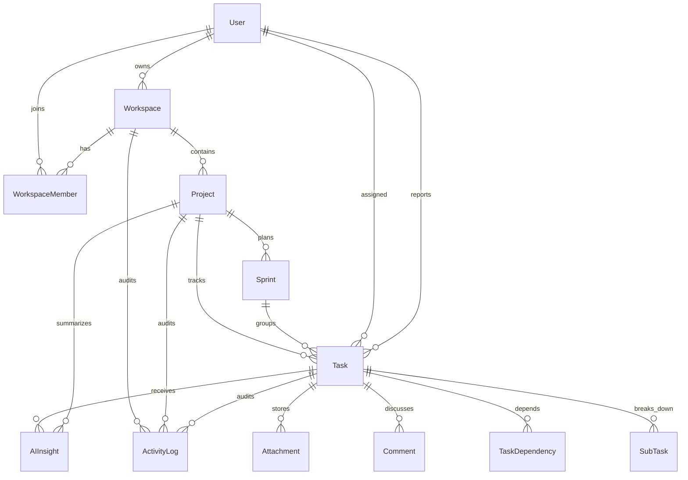

# Database ERD

```mermaid
erDiagram
  User ||--o{ Workspace : owns
  User ||--o{ WorkspaceMember : joins
  Workspace ||--o{ WorkspaceMember : has
  Workspace ||--o{ Project : contains
  Project ||--o{ Sprint : plans
  Project ||--o{ Task : tracks
  Sprint ||--o{ Task : groups
  User ||--o{ Task : assigned
  User ||--o{ Task : reports
  Task ||--o{ SubTask : breaks_down
  Task ||--o{ TaskDependency : depends
  Task ||--o{ Comment : discusses
  Task ||--o{ Attachment : stores
  Workspace ||--o{ ActivityLog : audits
  Project ||--o{ ActivityLog : audits
  Task ||--o{ ActivityLog : audits
  Task ||--o{ AIInsight : receives
  Project ||--o{ AIInsight : summarizes
```
